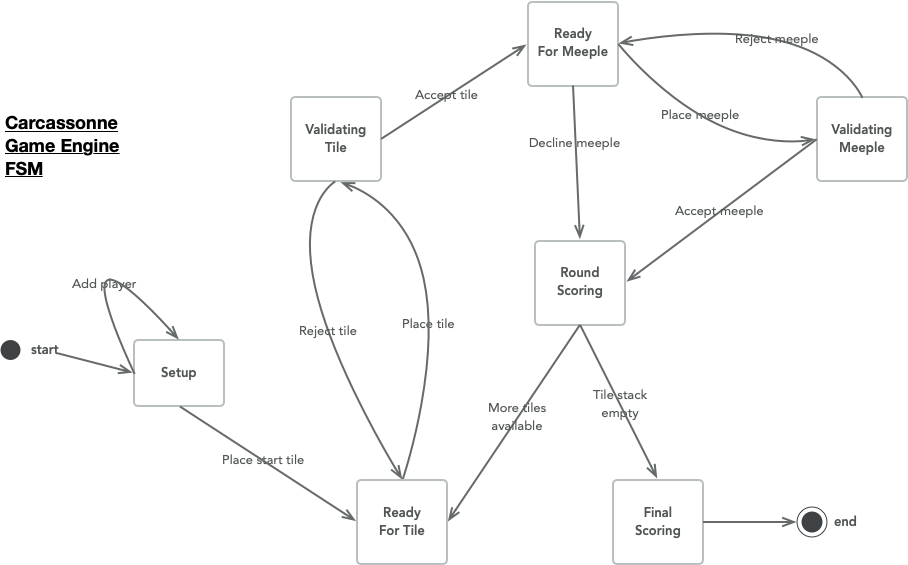

# FiniteSpark

https://en.wikipedia.org/wiki/Finite-state_machine

> Implement a fluent finite state machine engine

Before we get to that though we're going to implement this:

That's a design of game I'm writing. It will do nicely for an initial
example.

## TODO

- One of the main features of this is going to be in its ability to visualise the configuration of the machine
- Add default actions. Rather than ignore (do nothing), run a specific action.